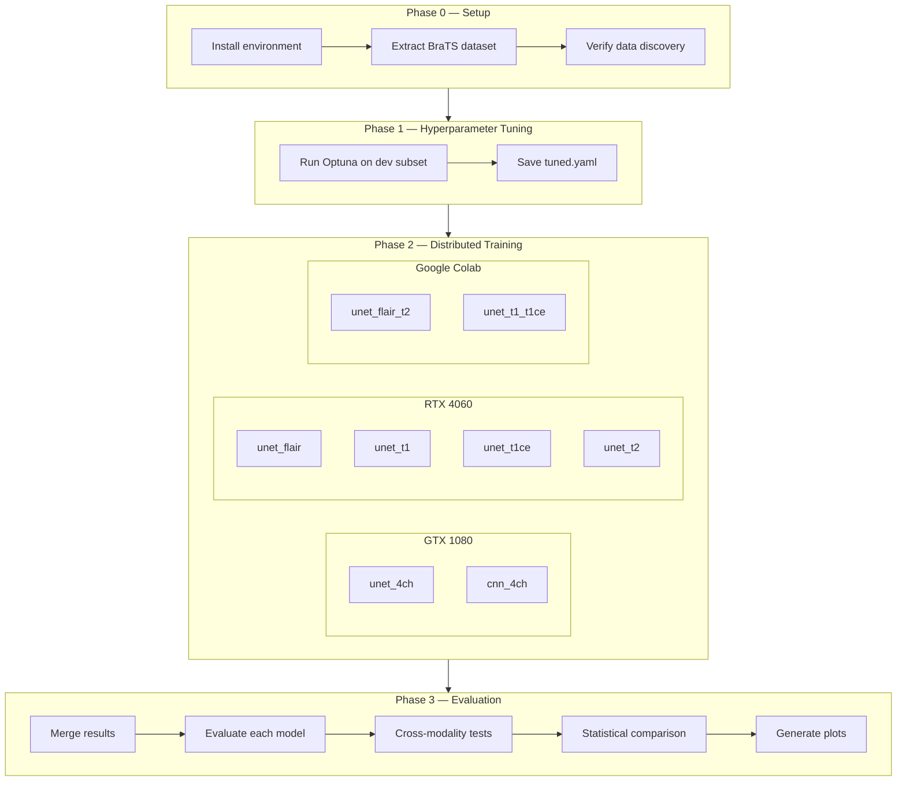

# Training Operations Guide

Technical reference for training, evaluating, and orchestrating the brain tumor segmentation pipeline across multiple devices.

---

## Pipeline Overview



---

## 1. Environment Setup Per Device

### Dependency Matrix

| | GTX 1080 (yours) | RTX 4060 (friend) | Colab (free/Pro) |
|---|---|---|---|
| **OS** | Windows 10/11 | Windows 10/11 | Linux (Ubuntu) |
| **Python** | 3.11 | 3.11 | 3.10–3.11 (pre-installed) |
| **PyTorch** | 2.3.1 | 2.5.1 | Pre-installed (~2.4+) |
| **CUDA Toolkit** | 12.1 | 12.4 | Pre-installed |
| **MONAI** | 1.4.0 | 1.4.0 | 1.4.0 |
| **Compute Cap** | 6.1 (Pascal) | 8.9 (Ada) | 7.5 (Turing) |
| **VRAM** | 8 GB | 8 GB | 6 GB |
| **Env name** | `gtx-1080-IP` | `rtx-4060-IP` | `gtx-1660s-IP` |
| **num_workers** | 0 (Windows deadlock) | 0–2 | 2–4 |
| **Max patch** | 96³ | 96³–128³ | 128³ |

### GTX 1080 (your machine)

```bash
conda env create -f environment.yml
conda activate gtx-1080-IP

# Verify
python -c "import torch; print(torch.__version__, torch.cuda.get_device_name(0))"
# Expected: 2.3.1 NVIDIA GeForce GTX 1080
```

`environment.yml` pins PyTorch 2.3.1 + CUDA 12.1. The `requirements.txt` (pip deps) is installed automatically.

> **Windows-specific:** Always use `num_workers: 0` in configs to avoid `CacheDataset` multiprocessing deadlocks. The `full.yaml` already sets `num_workers: 2` — if you hit hangs, override to 0.

### RTX 4060 (friend's machine)

```bash
conda create -n rtx-4060-IP python=3.11 -y
conda activate rtx-4060-IP
pip install torch==2.5.1 torchvision==0.20.1 torchaudio==2.5.1 --index-url https://download.pytorch.org/whl/cu124
pip install -r requirements.txt
```

PyTorch 2.5.1 is needed because 2.3.1 doesn't fully support Ada Lovelace (compute capability 8.9). Everything else is identical.

> **Optional optimization:** The 4060 can handle 128³ patches. Create `configs/rtx4060.yaml`:
> ```yaml
> preprocessing:
>   patch_size: [128, 128, 128]
> ```
> Then run with: `python scripts/run_experiment.py --experiment unet_flair --config rtx4060`

### Google Colab

```python
# Cell 1: Clone and setup
!git clone https://github.com/AcastaPaloma/integrative-project.git
%cd integrative-project
!python scripts/setup_colab.py --data_dir /content/drive/MyDrive/brats_data
```

Or manual setup:

```python
from google.colab import drive
drive.mount('/content/drive')

!pip install -q monai[all]==1.4.0 nibabel scikit-learn matplotlib tqdm wandb pyyaml scipy optuna
!ln -sf /content/drive/MyDrive/brats_data data/raw

# Verify GPU
!python -c "import torch; print(torch.cuda.get_device_name(0))"
```

> **Colab gotchas:**
> - Free tier disconnects after ~90 min idle, 12 hrs max
> - **Always use `--resume`** — Colab will disconnect mid-training
> - Save checkpoints to Drive, not `/content/` (ephemeral)
> - T4 has 15 GB VRAM — you can use 128³ patches and larger channels

---

## 2. Data Setup

### What you need

The full BraTS 2015 dataset from Kaggle (~274 cases, ~16 GB extracted):

```
data/raw/
├── HGG/
│   ├── brats_2013_pat0001_1/
│   │   ├── ...flair.nii
│   │   ├── ...t1.nii
│   │   ├── ...t1ce.nii
│   │   ├── ...t2.nii
│   │   └── ...seg.nii         (or OT.nii)
│   ├── brats_2013_pat0002_1/
│   └── ...
└── LGG/
    └── ...
```

### Steps

```bash
# 1. Extract the zip (when SSD arrives)
#    On Windows:
tar -xf brain-tumor-segmentation-in-mri-brats-2015.zip -C data/raw/

# 2. Verify discovery
python -c "
from src.data.dataset import discover_brats_samples
samples = discover_brats_samples('data/raw')
print(f'Found {len(samples)} patients')
print(f'First: {samples[0][\"patient_id\"]}')
print(f'Modalities: {list(samples[0].keys())}')
"
```

### Data on each device

Each device needs access to the same dataset. Options:

| Method | Pros | Cons |
|---|---|---|
| Chrome Remote Desktop | Fast local transfer | Requires host PC to be on |
| Google Drive | Easy sharing | Slow initial upload/download |
| USB drive | Simple | Requires physical access |

**Recommended:** Since you are using Chrome Remote Desktop to help your friends, use its "File Transfer" feature to drop your pre-extracted `data/MICCAI_BraTS2020_TrainingData` folder directly onto their PCs. This avoids downloading and extracting from scratch.

---

## 3. Hyperparameter Tuning

Run this **once** on any device (GTX 1080 recommended — you can monitor it).

```bash
python scripts/tune_hyperparams.py --n_trials 25 --epochs_per_trial 15 --max_samples 20
```

**What it does:**
- Runs 25 short training trials (15 epochs each) on a 20-sample subset
- Searches: `lr`, `weight_decay`, `dropout`, `channels`, `patch_size`
- Uses Optuna's MedianPruner to kill bad trials early
- Saves the best config to `configs/tuned.yaml`

**Time estimate:** ~2–4 hours on GTX 1080

**Output:**
```
configs/tuned.yaml          ← best hyperparameters
checkpoints/hp_tuning/      ← trial checkpoints (can delete after)
```

After tuning, copy `configs/tuned.yaml` to all devices (or push to git).

---

## 4. Training Experiments

### Experiment matrix

```
configs/experiments.yaml defines 10 experiments:

 EXPERIMENT          MODEL   MODALITIES            EST. TIME (GTX 1080)
 ─────────────────── ─────── ───────────────────── ────────────────────
 unet_4ch            UNet    flair+t1+t1ce+t2      20–30 hrs
 cnn_4ch             CNN     flair+t1+t1ce+t2      15–25 hrs
 unet_flair          UNet    flair                   8–13 hrs
 unet_t1             UNet    t1                      8–13 hrs
 unet_t1ce           UNet    t1ce                    8–13 hrs
 unet_t2             UNet    t2                      8–13 hrs
 unet_flair_t2       UNet    flair+t2               12–18 hrs
 unet_t1_t1ce        UNet    t1+t1ce                12–18 hrs
 unet_flair_t1ce     UNet    flair+t1ce             12–18 hrs
 unet_3ch_no_t1      UNet    flair+t1ce+t2          15–22 hrs
```

### Running a single experiment

```bash
python scripts/run_experiment.py --experiment unet_4ch --config full
```

### Resuming after interruption

```bash
python scripts/run_experiment.py --experiment unet_4ch --config full --resume
```

This loads `checkpoints/unet_4ch/last_model.pth` and continues from the last epoch. **Safe to Ctrl+C and resume anytime.**

### Device assignment plan

```
 DEVICE              EXPERIMENTS                        EST. WALL TIME
 ─────────────────── ────────────────────────────────── ─────────────
 GTX 1080 (you)      unet_4ch → cnn_4ch                 ~3 days
 RTX 4060 (friend 1) unet_flair → unet_t1 →             ~2 days
                      unet_t1ce → unet_t2
 GTX 1660S (friend 2)unet_flair_t2 → unet_t1_t1ce →     ~3 days
                      unet_flair_t1ce → unet_3ch_no_t1
```

Run experiments **sequentially** on each device (one at a time — VRAM constraint).

### Colab-specific training

```python
# In a Colab cell:
!python scripts/run_experiment.py --experiment unet_flair_t2 --config full --resume

# After each experiment finishes, copy results to Drive:
!cp -r outputs/results/unet_flair_t2 /content/drive/MyDrive/brats_results/
!cp -r checkpoints/unet_flair_t2 /content/drive/MyDrive/brats_checkpoints/
```

> **Colab tip:** Add `--resume` to EVERY command. Colab disconnects are inevitable. The checkpoint saves every epoch, so you lose at most ~10 minutes of work.

### Monitoring training

Each experiment logs:
- `checkpoints/{experiment}/best_model.pth` — best validation Dice
- `checkpoints/{experiment}/last_model.pth` — latest epoch
- `outputs/results/{experiment}/training_history.json` — all metrics per epoch

If WandB is enabled (`use_wandb: true` in config), track live at [wandb.ai](https://wandb.ai).

---

## 5. Merging Results from Multiple Devices

After all devices finish their assigned experiments:

### Step 1: Collect results

```bash
# From friend's USB:
xcopy /E F:\results\unet_flair outputs\results\unet_flair\
xcopy /E F:\results\unet_t1 outputs\results\unet_t1\
# ... etc

# From Colab (download from Drive):
# Copy brats_results/ and brats_checkpoints/ from Drive to local
```

### Step 2: Merge

```bash
python scripts/merge_results.py \
  --sources outputs/results F:\friend_results E:\colab_results \
  --target outputs/results_merged
```

This copies experiment directories into one unified `results_merged/` folder with duplicate detection and checkpoint validation.

### Step 3: Also merge checkpoints

Checkpoints are separate from results. Copy them manually:

```bash
xcopy /E F:\checkpoints\unet_flair checkpoints\unet_flair\
# ... etc
```

---

## 6. Evaluation

### Evaluate each trained model

```bash
python scripts/evaluate_experiment.py --experiment unet_4ch --config full
python scripts/evaluate_experiment.py --experiment cnn_4ch --config full
python scripts/evaluate_experiment.py --experiment unet_flair --config full
# ... etc for all experiments
```

**Output per experiment:**
```
outputs/results/{experiment}/
├── evaluation_results.json     ← per-case Dice, HD95, precision, recall
├── predictions/                ← NIfTI predictions
└── visualizations/             ← overlay PNGs
```

### Cross-modality portability tests

Tests whether the 4ch model still works when given only a subset of modalities (missing channels zeroed):

```bash
python scripts/run_cross_modality.py --config full
```

**Requires:** `checkpoints/unet_4ch/best_model.pth` to exist.

**Output:**
```
outputs/results/cross_modality/
└── cross_modality_results.json
```

---

## 7. Statistical Comparison

After all experiments are evaluated:

```bash
python scripts/compare_models.py --config full --results_dir outputs/results_merged
```

**Tests run:**

| Test | What it answers |
|---|---|
| Paired Wilcoxon signed-rank | Is model A significantly better than B? |
| Friedman + Nemenyi post-hoc | Which model ranks best among all? |
| Bootstrap 95% CI | What's the confidence interval on mean Dice? |
| Cohen's d | How big is the practical effect? |
| McNemar's test | Do models fail on different cases? |

**Output:**
```
outputs/results_merged/comparison/
├── model_summary.csv           ← mean Dice + 95% CI per model
├── pairwise_wilcoxon.csv       ← pairwise significance tests
├── effect_sizes.csv            ← Cohen's d per pair
├── confidence_intervals.csv    ← bootstrap CIs per class per model
└── full_comparison.json        ← raw test results
```

---

## 8. Visualization

```bash
python scripts/generate_plots.py --results_dir outputs/results_merged
```

**Generates:**
```
outputs/results_merged/plots/
├── training_curves.png         ← loss + Dice over epochs (all models)
├── dice_comparison_bar.png     ← per-class Dice bar chart
├── dice_boxplots.png           ← per-patient Dice distributions
└── cross_modality_heatmap.png  ← portability degradation matrix
```

---

## 9. Full Workflow Checklist

```
[ ] 1. Extract BraTS dataset to data/raw/
[ ] 2. Verify: python -c "from src.data.dataset import ..."
[ ] 3. Run HP tuning: python scripts/tune_hyperparams.py ...
[ ] 4. Copy tuned.yaml to all devices (git push)
[ ] 5. Copy data to friend's PC (USB) and Colab (Drive)
[ ] 6. Start training on all 3 devices
[ ] 7. Monitor checkpoints and WandB
[ ] 8. When all done: collect results from all devices
[ ] 9. Merge: python scripts/merge_results.py ...
[ ] 10. Evaluate all: python scripts/evaluate_experiment.py ... (×10)
[ ] 11. Cross-modality: python scripts/run_cross_modality.py
[ ] 12. Stats: python scripts/compare_models.py ...
[ ] 13. Plots: python scripts/generate_plots.py ...
[ ] 14. Review outputs/results_merged/ for final report
```

---

## 10. Troubleshooting

| Problem | Fix |
|---|---|
| **OOM on GTX 1080** | Ensure `full.yaml` uses 96³ patches and channels `[24,48,96,192]`. Set `sw_batch_size: 1`. |
| **Windows deadlock** | Set `num_workers: 0` in your config. |
| **Colab disconnect** | Always use `--resume`. Copy checkpoints to Drive after each epoch block. |
| **`No module named src`** | Run from project root. Scripts add parent to `sys.path` but CWD must be correct. |
| **Checkpoint won't load** | Checkpoints are GPU-agnostic. Use `map_location="cuda:0"` (already handled). |
| **Mismatched `in_channels`** | Each experiment sets `in_channels` automatically from `experiments.yaml`. Don't mix checkpoints between experiments. |
| **Optuna import error** | `pip install optuna>=3.0` |
| **Slow data loading** | Increase `cache_rate` in train script. First epoch is slow (caching); subsequent are fast. |
| **Friend installed wrong PyTorch** | RTX 4060 needs `cu124` wheel. `cu121` may work but is suboptimal. |
| **WandB login** | Run `wandb login` once per device. Or set `use_wandb: false` in config. |

---

## 11. Project Structure Reference

```
integrative-project/
├── configs/
│   ├── default.yaml            ← base config (all defaults)
│   ├── dev.yaml                ← small data, fast iteration
│   ├── full.yaml               ← production training (GTX 1080 safe)
│   ├── experiments.yaml        ← experiment matrix definition
│   └── tuned.yaml              ← auto-generated by HP tuning
├── scripts/
│   ├── train.py                ← original training script
│   ├── run_experiment.py       ← ★ single experiment runner
│   ├── run_cross_modality.py   ← ★ zero-pad portability tests
│   ├── tune_hyperparams.py     ← ★ Optuna HP search
│   ├── evaluate.py             ← original evaluation script
│   ├── evaluate_experiment.py  ← ★ experiment-aware evaluation
│   ├── predict.py              ← standalone inference
│   ├── compare_models.py       ← ★ statistical comparison
│   ├── generate_plots.py       ← ★ publication-quality plots
│   ├── setup_colab.py          ← ★ Colab auto-setup
│   └── merge_results.py        ← ★ multi-device result merge
├── src/
│   ├── data/
│   │   ├── dataset.py          ← data discovery + modality filtering
│   │   ├── splits.py           ← deterministic train/val/test split
│   │   └── transforms.py       ← MONAI preprocessing + augmentation
│   ├── models/
│   │   ├── unet3d.py           ← MONAI U-Net + model factory
│   │   └── cnn3d.py            ← ★ plain 3D CNN baseline
│   ├── training/
│   │   ├── trainer.py          ← training loop + checkpointing
│   │   └── losses.py           ← DiceCE loss
│   ├── inference/
│   │   └── predict.py          ← sliding window inference
│   ├── evaluation/
│   │   ├── metrics.py          ← Dice, HD95, precision, recall
│   │   ├── statistical_tests.py ← ★ Wilcoxon, Friedman, bootstrap
│   │   ├── visualize.py        ← overlay + multi-view figures
│   │   └── report.py           ← markdown report generator
│   └── utils/
│       ├── config.py           ← YAML config loader
│       ├── logging.py          ← WandB + console logging
│       └── seed.py             ← reproducibility seeding
├── data/raw/                   ← BraTS dataset (not in git)
├── checkpoints/                ← model weights (not in git)
├── outputs/                    ← results, predictions, plots (not in git)
├── GPU_SETUP.md                ← environment setup per GPU
├── requirements.txt            ← pip dependencies
└── environment.yml             ← conda environment (GTX 1080)
```

`★` = new files added in this pipeline build
